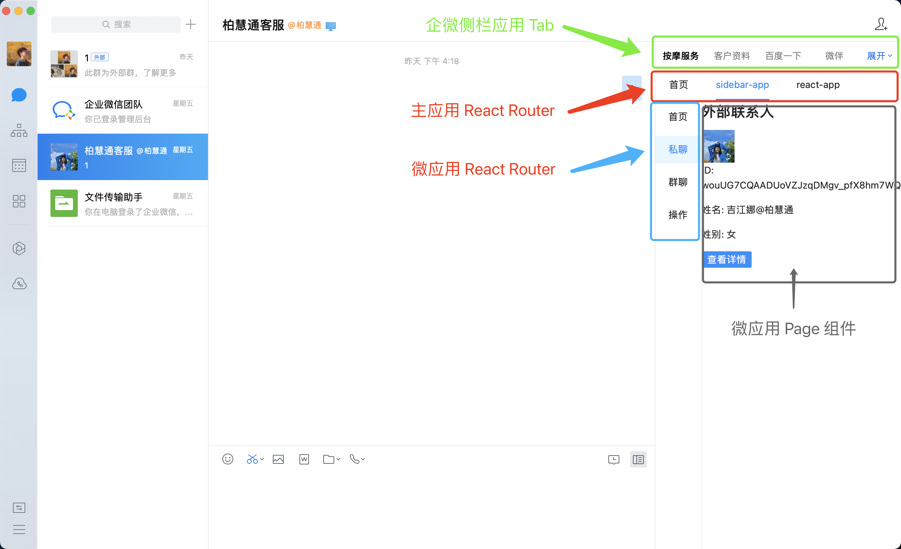
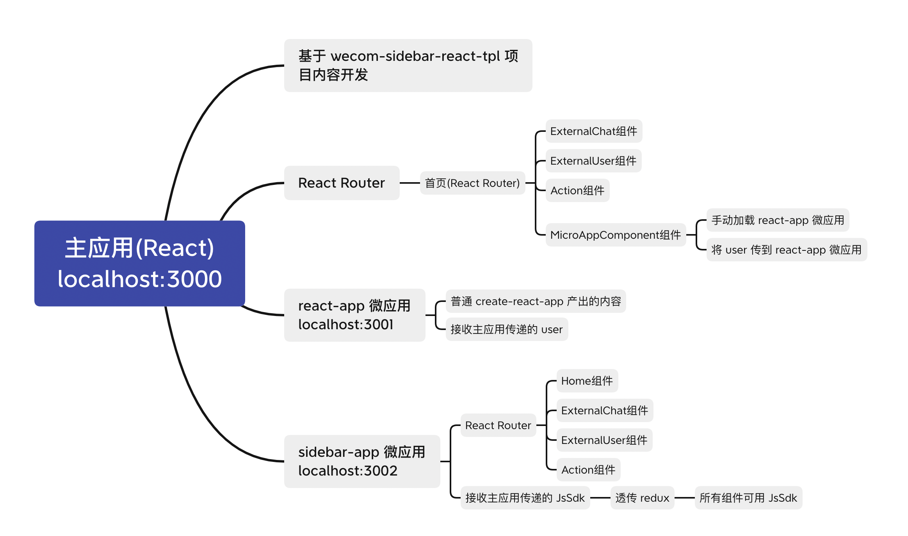
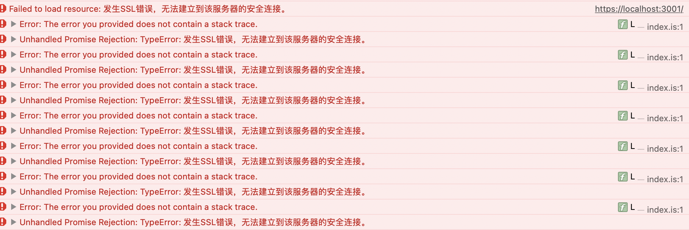

# wecom-sidebar-qiankun-tpl

此项目为企业微信侧边栏 + qiankun 微前端框架的实践模板。



## 痛点

为什么还要搞一个微前端模板呢？如果开发多个侧边栏应用时，会有以下痛点：

* **所有侧栏应用为硬隔离**。切换不同应用都要重新加载
* **基础信息不共享**。重新加载又需要重新初始化 JS-SDK 和获取群聊、私聊、用户身份的信息，而这些信息对于每个应用都是必需的，不应该每次都重新获取
* **方便多团队协作**。应对已有 H5 嵌入到侧边栏的场景

## 微前端思路

企微侧边栏的配置本质上就是配置 `应用名` 和 `H5  URL`，这和 [qiankun](https://qiankun.umijs.org/zh) 微前端框架注册微应用的方式非常相似！
所以，我就想不如尝试使用 qiankun 注册微应用的试来 "注册侧边栏应用"。

除了正常的微应用注册，我还希望有如下功能：
* 微应用可以从主应用获取一些公共信息，比如 `userId` 之类
* 微应用同时可以获取主应用的 `jsSdk` 对象，直接使用 `jsSdk` 与企业微信交互
* 主应用会自动完成 `用户身份验证` 和 `JS-SDK` 的初始化，微应用不再需要做公共逻辑，自动拥有业务所需数据
* 主应用除了像 Router 那样自动注册微应用，还能在指定 container 里手动注册微应用

而 [qiankun](https://qiankun.umijs.org/zh) 都能完美地解决我的问题。不妨来看看这个模板能带给你什么吧。

## 内容

为了能覆盖大多数应用场景，本项目尝试了如下场景：

- 主应用
  - [x] 初始化侧边栏的所有配置（可见：[wecom-sidebar-react-tpl 这个模板项目](https://github.com/wecom-sidebar/wecom-sidebar-react-tpl)）
  - [x] React Router，拥有独立路由系统（Hash Router）
  - [x] 手动加载微应用（以 react-app 为例）
  - [x] 与微应用通信
    - [x] 手动加载时，将用户信息 user 传给 react-app 微应用
    - [x] 注册微应用时，将 jsSdk 传给 sidebar-app 微应用，使其能与企业微信交互
- react-app 微应用
  - [x] 与主应用通信，从主应用接收 user 对象
  - [x] 该应用仅以 creat-react-app 创建，比较纯净，开发者可基于该应用编写你的侧边栏代码
- sidebar-app 微应用
  - [x] React Router，拥有微应用自己的独立路由系统，与主应用形成嵌套关系
  - [x] 与主应用通信，从主应用接收 jsSdk 对象，并在自己组件内调用企微的 JSSDK 的 API
  - [x] 该项目可作为你编写侧边栏微应用的模板

具体架构可见：



## 前置配置

说了那么多，不如先启动来玩玩。但是，由于企业微信侧边栏是一个非常复杂的开发环境，而且业务名词也比较多，
所以，你需要做一些前置操作才能将本项目跑起来。

不过，不要慌，你要了解的前置知识我都帮你准备好了，请继续往下看~

### 后端服务

在运行这个项目前，你需要一个后端（Node）来转发企业微信的后端 API，以及生成 JS-SDK 的签名。

不过，不用太担心，我已经写好了一个 Node 端的开发模板，可以查看 [wecom-sidebar-express-tpl](https://github.com/wecom-sidebar/wecom-sidebar-express-tpl) 。

当然不看也没关系，按下面的步骤增就可以了：

```shell
# clone 下来
git clone https://github.com/wecom-sidebar/wecom-sidebar-express-tpl.git
```

其中需要用到 `corpId`, `agentId`, `corpSecret`，需要在项目根目录创建 `.env`（目前已隐藏），示例

```dotenv
# .env

# Redis
REDIS_HOST=localhost
REDIS_PORT=6379

# 在 https://work.weixin.qq.com/wework_admin/frame#profile 这里可以找到
CORP_ID=企业ID

# 在 https://work.weixin.qq.com/wework_admin/frame#apps 里的自建应用里可以找到（注意这里是自建应用里的 secret，不是客户联系里的回调 secret）
CORP_SECRET=自建应用的CORP_SECRET

# 在 https://work.weixin.qq.com/wework_admin/frame#apps 里的自建应用里可以找到
AGENT_ID=自建应用的AGENT_ID
```

然后使用 docker 来启动 redis：

```shell
docker-compose -f docker-compose.yml up -d
```

然后使用 npm 启动项目：

```shell
npm run dev
```

API 接口在 `localhost:5000` 上访问。

### 基础配置

启动项目需要用到 `agentId` 和 `corpId`，需要创建 `src/_config.ts`（目前已隐藏），示例

```ts
// src/_config.ts

const config = {
  // 在 https://work.weixin.qq.com/wework_admin/frame#profile 这里可以找到
  corpId: '你的企业ID',
  // 在 https://work.weixin.qq.com/wework_admin/frame#apps 里的自建应用里可以找到
  agentId: '自建应用的AgentId'
}

export default config
```

## 代理配置

代理配置这里需要用到 [Whistle](https://wproxy.org/whistle/) 这个代理工具，请在 [这篇教程](https://wproxy.org/whistle/install.html) 里先安装 Whistle，
然后再在 [这篇教程](http://wproxy.org/whistle/webui/https.html) 中正确安装 HTTPS 证书（用于代理 HTTPS 流量），两个步骤请一定要正确执行！

然后在 whistle 中添加以下的代理配置，将后端路由传向本地

```
# 代理前端（侧边栏页面代理到本地的 3000 端口），这里要改为你自己配置H5的地址就好
//service-xxx-yyy.gz.apigw.tencentcs.com http://127.0.0.1:3000

# 代理后端（后端模板的 baseURL 该模板写死为 backend.com，这里代理到本地的 5000 端口）
//backend.com http://127.0.0.1:5000

# 全局注入 mock.js
//service-xxx-yyy.gz.apigw.tencentcs.com  jsPrepend://{mock.js}
```

### Mock

**此功能可以使得你在浏览器上直接调试侧边栏应用！**

**在浏览器模式下，会 Mock `jsSdk`，默认回调为空函数，并打上对应日志。你也可以在 `src/mock.ts` 下可以添加对 `wx.fn` 和 `wx.invoke` 这些函数的 Mock 值以及 Mock 函数。**

**如果你不想将 Mock 写死在项目上，你也可以利用 [Whistle 预先注入全局 JS](https://wproxy.org/whistle/rules/jsPrepend.html)，以此在全局注入对应的 Mock 值和回调函数。**

Whistle 的 `Rules` 可以写成：

```
# 代理前端（侧边栏页面代理到本地的 3000 端口），这里要改为你自己配置H5的地址就好
//service-xxx-yyy.gz.apigw.tencentcs.com http://127.0.0.1:3000

# 代理后端（后端模板的 baseURL 该模板写死为 backend.com，这里代理到本地的 5000 端口）
//backend.com http://127.0.0.1:5000

# 全局注入 mock.js
//service-xxx-yyy.gz.apigw.tencentcs.com  jsPrepend://{mock.js}
```

然后在 Whistle 页面的 `Values` (输入 http://127.0.0.1:8899/#values 可见) 中会自动生成一个 `mock.js`，再在里面添加如下代码：

```js
// Mock 当前用户 Id
window.mockUserId = 'xxx';

// 可在这里自由 mock wx.invoke 的内容
window.invokeResMock = {
  'getCurExternalContact': {
    userId: 'xxxxx'
  },
};

// 可在这里自由 wx.fn 的内容
window.wxResMock = {
  'agentConfig': () => {
    console.log('mock agent config')
  },
};
```

这里对应的 Mock 关系 Mapper 有 `wxResMock` 和 `invokeResMock` 分别对 `wx.fn` 和 `wx.invoke('api', callback')` 两种调用方式进行 Mock。

## 启动项目

启动主应用，在 http://localhost:3000 运行。

```shell
npm run start
```

启动 react-app 微应用，在 http://localhost:3001 可单独运行。

```shell
cd ./apps/react-app

npm run start
```

启动 sidebar-app 微应用，在 http://localhost:3002 可单独运行。

```shell
cd ./apps/sidebar-app

npm run start
```

## 项目这么大，该从哪看看起

项目的主应用是基于 [wecom-sidebar-react-tpl](https://github.com/wecom-sidebar/wecom-sidebar-react-tpl) 项目来修改，
所以关于 `代理配置`, `应用配置`, `Mock 功能` 等都可以查看这个项目来了解更多。

项目的 Node 端服务使用了 [wecom-sidebar-express-tpl](https://github.com/wecom-sidebar/wecom-sidebar-react-tpl) 这个项目，
这里没有对它进行改动，直接看原 repo 即可。

### 主应用

这里仅仅在入口 `index.tsx` 里调用了 `initQiankunMainApp` 这个初始化函数，也可以查看 `lib/utils/initQianKunApp` 来了解更多。

### 微应用

微应用为原有项目新增的内容，添加了 `react-app` 和 `sidebar-app` 两个微应用项目，它们都放在 [./apps 目录下](./apps) ，。

对于 `react-app`，这只是一个纯净的 React 项目，仅在入口 `index.tsx` 里添加了与主应用对接所需要的生命周期回调。
你可以在这个纯净的项目里开始编写你的侧边栏应用。你可以 [点击这里](./apps/react-app/README.md) 了解更多内容。

对于 `sidebar-app`，这算是我自己写的一个侧边栏微应用，除了在入口 `index.tsx` 添加生命周期回调，还将主应用的数据存于 redux store 中，
同时，添加了 React Router，分别对于 4 个页面组件：Home, ExternalChat, ExternalUser, Action。你可以以这个微应用为模板一步步实现自己的微应用。
你可以 [点击这里](./apps/sidebar-app/README.md) 了解更多内容。

## 一些问题

### SSL 错误

报错：发生 SSL 错误，无法建立到该服务器的安全连接。



这是因为主应用和微应用的 URL 协议不致导致的，比如主应用为 https，而微应用是 http，就会有这样的错误。

解决方法就把它们改成一致就好了，目前我是都改为 http，因为 react 跑的 dev server 一般都不是 https 的。

### Router 问题

使用 qiankun 的时候，主应用和微应用的 Router 类型最好都一样，比如主应用为 Hash Router，微应用也用 Hash Router，
主应用使用 history 模式的 BrowserRouter，微应用也要用 Browser。如果两者类型不一样会有各种各样的问题

我这里选用了 HashRouter，这是因为如果使用 history 模式的话，每次切换路由时都需要初始化企业微信，非常不方便，
可以参考 [文档这里的步骤二](https://open.work.weixin.qq.com/api/doc/90001/90144/90547)。
